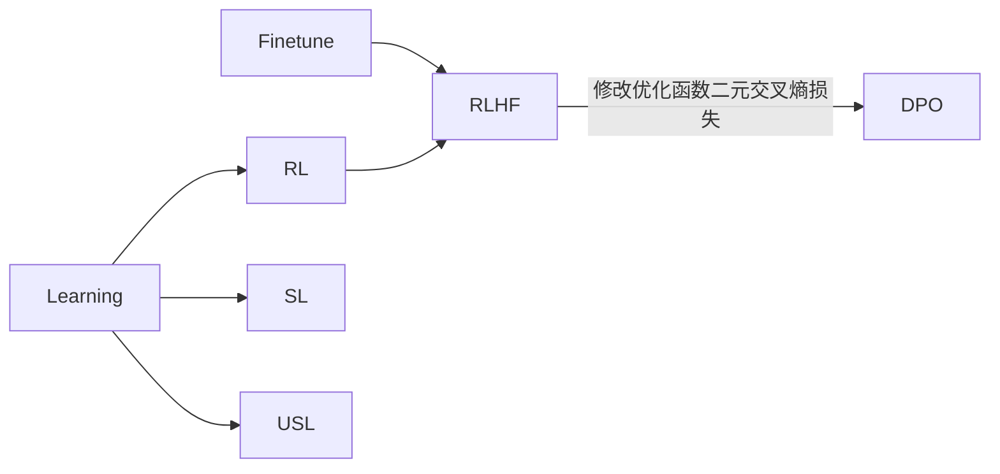

# Learning 学习方式
## RL Reinforcement Learning 强化学习
## SL Supervised Learning 有监督学习
### Self-Supervised Learning 自监督学习 
## USL Unsupervised Learning 无监督学习 

# Finetune
## RLHF: 基于人类反馈的强化学习 (Reinforcement Learning from Human Feedback)

## DPO: 直接偏好优化 Direct Preference Optimization 
将现有方法使用的基于强化学习的目标转换为可以通过简单的二元交叉熵损失直接优化的目标，这一做法大大简化了 LLM 的提纯过程。

## SFT: 有监督微调 (supervised fine-tuning)
## IT: 指令调优 instruction tuning

# 模型
## LLM LargeLanguageModel 语言模型
### Base_Language_Model 基础语言模型
### QA 问答模型

## Visual 视觉模型
### 图像分类
### Text-to-Image

## 模型结构
### transformer Model 模型
### SSM State Space Model 状态空间
### Diffusion 模型扩散模型

# prompting 提示工程

# Model_evaluation 模型评估
## LLM-as-a-Judege

# 场景